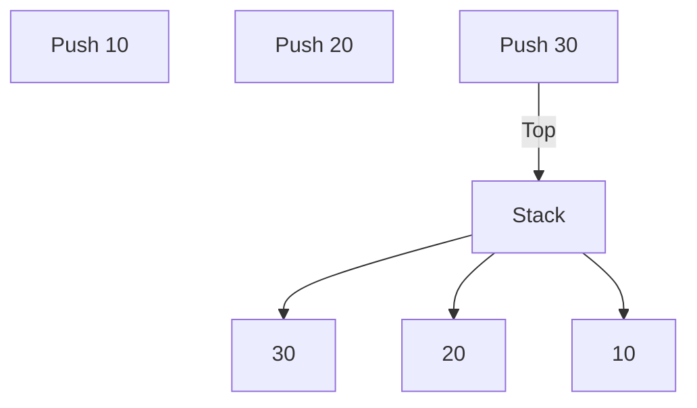

# 📚 Stack

`std::stack` is a **container adapter** provided by the C++ Standard Template Library (STL). It follows the **Last-In, First-Out (LIFO)** principle, meaning the most recently inserted element is the first one to be removed.

Rather than exposing every operation of the underlying container, a stack provides a simplified interface that allows access only to the top element, making it ideal for problems that naturally follow a LIFO order.



---

# 📖 Prerequisites

Before studying this topic, you should be familiar with:

* Basic C++ syntax
* Functions and loops
* STL Containers
* `std::vector`
* `std::deque`

---

# 🎯 Learning Objectives

After completing this section, you should be able to:

* Understand the LIFO principle.
* Create and initialize a stack.
* Push and pop elements.
* Access the top element.
* Check whether a stack is empty.
* Solve common interview problems using stacks.

---

# 📂 Directory Structure

```text
Stack/
├── stack.cpp
├── PracticeProblems/
│   ├── reverserStack.cpp
│   └── README.md
└── README.md
```

---

# 📄 File Overview

## `stack.cpp`

Introduces the fundamentals of `std::stack`.

### Topics Covered

* Creating a stack
* `push()`
* `pop()`
* `top()`
* `size()`
* `empty()`
* Traversing a stack (by popping elements)

This file serves as an introduction to the most common stack operations.

---

## `PracticeProblems/`

Contains practical problems designed to reinforce stack concepts through implementation.

Current problem:

* `reverserStack.cpp`

This example demonstrates how stacks can be used to reverse the order of elements while reinforcing the LIFO principle.

---

# ⚡ Common Operations

| Operation | Complexity |
| --------- | ---------: |
| `push()`  |       O(1) |
| `pop()`   |       O(1) |
| `top()`   |       O(1) |
| `size()`  |       O(1) |
| `empty()` |       O(1) |

---

# 💡 When Should You Use a Stack?

A stack is the ideal choice when:

* The last inserted item should be processed first.
* You need to keep track of recursive calls.
* Undo operations are required.
* Nested structures need to be validated.
* Backtracking is involved.

---

# 🌍 Real-World Applications

Stacks are used extensively in:

* Function call management (Call Stack)
* Expression evaluation
* Parentheses matching
* Browser history
* Undo/Redo systems
* Backtracking algorithms
* Depth-First Search (DFS)
* Syntax parsing in compilers

---

# 📌 Quick Reference

| Function  | Purpose                          |
| --------- | -------------------------------- |
| `push()`  | Insert an element                |
| `pop()`   | Remove the top element           |
| `top()`   | Access the top element           |
| `empty()` | Check whether the stack is empty |
| `size()`  | Return the number of elements    |

---

# 🎯 Suggested Practice

After understanding the basics, try implementing:

* Balanced Parentheses Checker
* Infix to Postfix Conversion
* Postfix Expression Evaluation
* Next Greater Element
* Min Stack
* Browser Back Button
* Reverse a String using a Stack

---

# 📝 Key Takeaways

* Stack follows the **LIFO (Last-In, First-Out)** principle.
* Only the top element is directly accessible.
* All core operations execute in constant time.
* Stacks are essential for recursion, parsing, DFS, and many interview problems.

---

# 🔗 Continue Learning

⬅️ Previous: [Deque](../Deque/README.md)

➡️ Next: [Queue](../Queue/README.md)

🏠 Back to: [STL Containers](../README.md)

🏠 Repository Home: [../../README.md](../../README.md)

