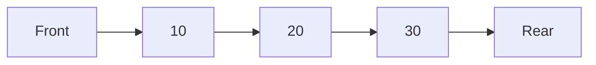

# 🚶 Queue

`std::queue` is a **container adapter** provided by the C++ Standard Template Library (STL). It follows the **First-In, First-Out (FIFO)** principle, meaning the first element inserted into the queue is the first one to be removed.

Queues are commonly used to process tasks in the order they arrive, making them an essential data structure in operating systems, networking, simulations, and graph algorithms.



---

# 📖 Prerequisites

Before studying this topic, you should be familiar with:

* Basic C++ syntax
* Functions and loops
* STL Containers
* `std::vector`
* `std::deque`
* Basic understanding of Stack (recommended)

---

# 🎯 Learning Objectives

After completing this section, you should be able to:

* Understand the FIFO principle.
* Create and initialize a queue.
* Insert and remove elements.
* Access the front and rear elements.
* Determine when a queue is more appropriate than a stack.
* Solve common interview problems involving queues.

---

# 📂 Directory Structure

```text
Queue/
├── queue.cpp
├── PracticeProblems/
│   ├── reverserQueue.cpp
│   └── README.md
└── README.md
```

---

# 📄 File Overview

## `queue.cpp`

Introduces the core functionality of `std::queue`.

### Topics Covered

* Creating a queue
* `push()`
* `pop()`
* `front()`
* `back()`
* `size()`
* `empty()`

The examples demonstrate the standard operations performed on a queue while reinforcing the FIFO principle.

---

## `PracticeProblems/`

Contains practical implementations that apply queue concepts to real programming problems.

Current problem:

* `reverserQueue.cpp`

This exercise demonstrates how queue operations can be manipulated to reverse or reorder elements, helping reinforce the behavior of FIFO data structures.

---

# ⚡ Common Operations

| Operation | Complexity |
| --------- | ---------: |
| `push()`  |       O(1) |
| `pop()`   |       O(1) |
| `front()` |       O(1) |
| `back()`  |       O(1) |
| `size()`  |       O(1) |
| `empty()` |       O(1) |

---

# 💡 When Should You Use a Queue?

A queue is the ideal choice when:

* Tasks must be processed in the order they arrive.
* Scheduling operations are required.
* Breadth-First Search (BFS) is performed.
* Resources are shared fairly among multiple requests.
* Producer-consumer workflows need buffering.

---

# 🌍 Real-World Applications

Queues are widely used in:

* CPU Process Scheduling
* Printer Job Management
* Breadth-First Search (BFS)
* Web Server Request Handling
* Network Packet Processing
* Ticket Booking Systems
* Simulation Systems
* Customer Service Systems

---

# 📌 Quick Reference

| Function  | Purpose                          |
| --------- | -------------------------------- |
| `push()`  | Insert an element at the rear    |
| `pop()`   | Remove the front element         |
| `front()` | Access the first element         |
| `back()`  | Access the last element          |
| `empty()` | Check whether the queue is empty |
| `size()`  | Return the number of elements    |

---

# 🔄 Stack vs Queue

| Feature     |      Stack      |      Queue      |
| ----------- | :-------------: | :-------------: |
| Principle   |       LIFO      |       FIFO      |
| Insert      |       Top       |       Rear      |
| Remove      |       Top       |      Front      |
| Common Use  | Recursion, Undo | Scheduling, BFS |
| STL Adapter |   `std::stack`  |   `std::queue`  |

---

# 🎯 Suggested Practice

After completing this section, try implementing:

* Circular Queue
* Hot Potato Game Simulation
* Printer Queue Simulation
* Rotten Oranges (BFS)
* Binary Tree Level Order Traversal
* First Non-Repeating Character in a Stream
* Implement Queue using Two Stacks

---

# 📝 Key Takeaways

* A queue follows the **FIFO (First-In, First-Out)** principle.
* Elements are inserted at the rear and removed from the front.
* All core operations execute in constant time.
* Queues are fundamental for scheduling, buffering, graph traversal, and many interview questions.

---

# 🔗 Continue Learning

⬅️ Previous: [Stack](../Stack/README.md)

➡️ Next: [Priority Queue](../PriorityQueue/README.md)

🏠 Back to: [STL Containers](../README.md)

🏠 Repository Home: [../../README.md](../../README.md)
